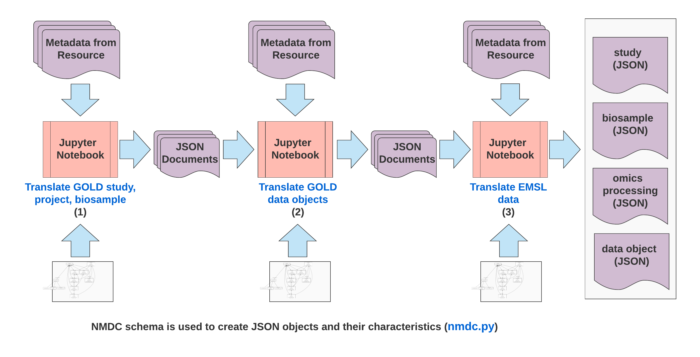
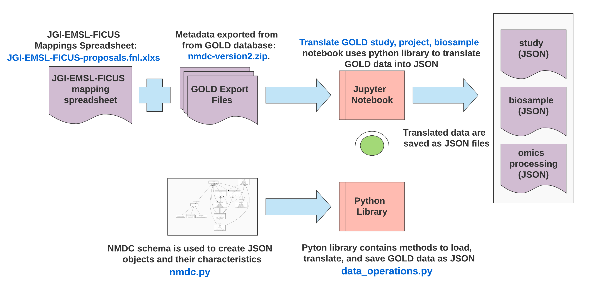

# Notebooks
We use [Jupyter notebooks](https://jupyter.org/) to integrate the metadata sources. This allows us to iterate quickly in a transparent and interactive manner as new metadata sources become available. 

## Notebook setup
We use [venv](https://docs.python.org/3/tutorial/venv.html) to create a virtual enironment.  

To create a virtual environment run the command `python3 -m venv <environment name>`  .  
I typically name my environment `.env`, and configure `.gitignore` to ignore `.env` files. This prevents the environment libraries from being uploaded to the repository.  

After the environment is created, run the command `source <environment name>/bin/activate` to enter the environment.  
Once in the environment, run the command `pip install -r requirements.txt` to install the necessary python libraries.

You exit the environment by executing the command `deactivate` in the terminal.

## Translation workflow

The metadata translation workflow consists of the notebooks executed in the following order:
1. [Translate GOLD study, project, biosample](https://github.com/microbiomedata/nmdc-metadata/blob/master/metadata-translation/notebooks/translate-GOLD-study-project-biosample.ipynb)
2. [Translate GOLD data objects](https://github.com/microbiomedata/nmdc-metadata/blob/master/metadata-translation/notebooks/translate-GOLD-data-objects.ipynb)
3. [Translate EMSL data](https://github.com/microbiomedata/nmdc-metadata/blob/master/metadata-translation/notebooks/translate-EMSL-data.ipynb)

## Translate GOLD study, project, biosample

## Translate GOLD data objects

## Translate EMSL data

TODO
